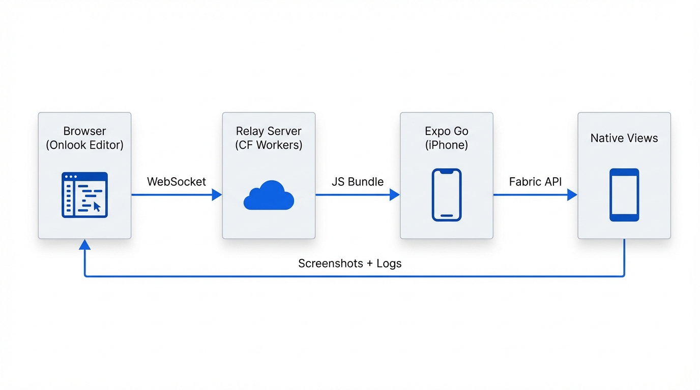
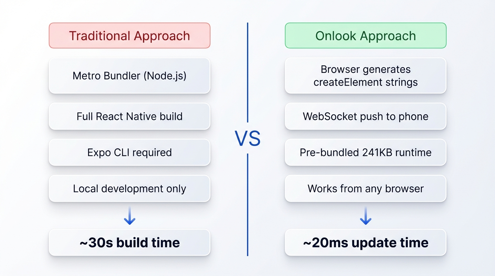
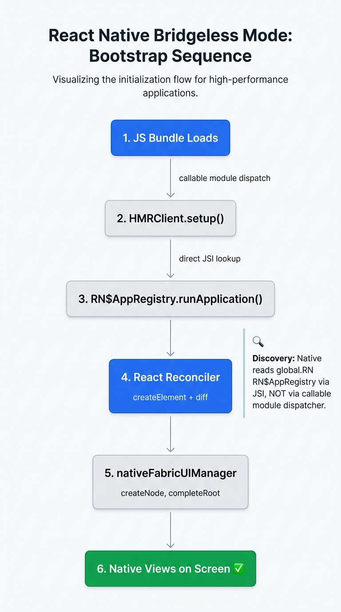
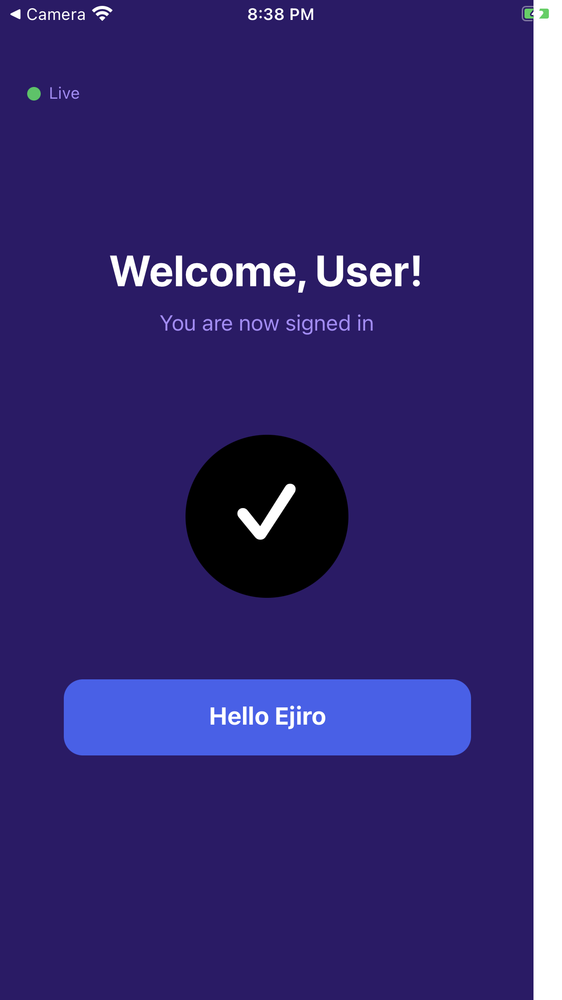
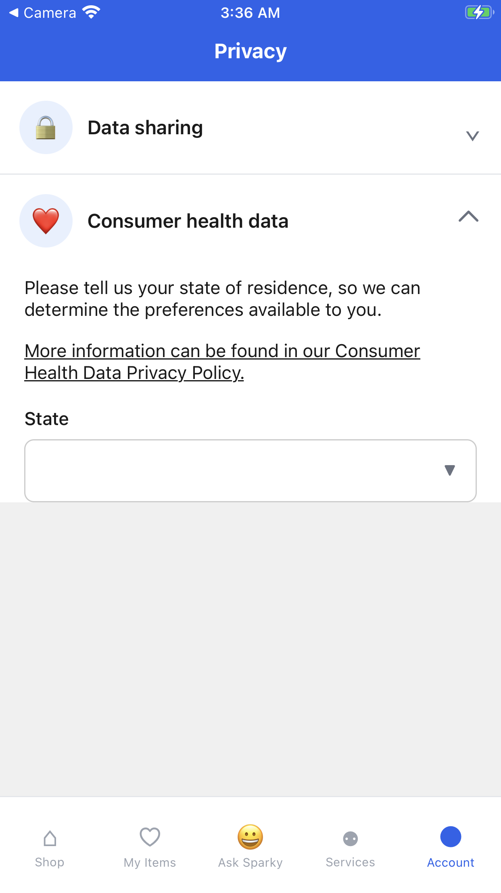

# How We Built a Native Mobile Preview That Runs Entirely From the Browser

*By the Onlook team*

What if you could push a UI change from a browser-based editor and see it render on a physical iPhone in 20 milliseconds — with no Metro, no Expo CLI, no Node.js, and no build step?

We did it. Here's how.

Onlook is a visual-first code editor for building mobile apps. We needed a way for designers and developers to see their changes on a real device instantly, without requiring any local tooling. The entire editing experience runs in the browser — so the preview system had to work from the browser too.

This post walks through how we reverse-engineered Expo Go's bridgeless runtime, built a custom React Fabric renderer that fits in 241KB, and wired it all together with WebSocket hot reload and `eval()` — creating a native mobile preview pipeline that needs nothing more than a browser and a phone.


*The complete pipeline: browser editor generates React code, pushes via WebSocket to Expo Go, which renders native views through React's Fabric reconciler.*

## The problem: native preview without native tooling

Traditional React Native development requires a heavyweight local setup:

- **Metro Bundler** running as a Node.js process
- **Expo CLI** or **React Native CLI** managing the dev server
- A full `node_modules` directory with thousands of packages
- 10-30 second build times for each change

For a browser-based editor like Onlook, none of this is acceptable. Our users open a URL and start editing. There's no terminal, no `npm install`, no local file system. We needed a preview system that:

1. Runs entirely from the browser (no server-side Node.js per user)
2. Updates in milliseconds, not seconds
3. Renders real native views on a physical device (not a web simulation)
4. Works with Expo Go (no custom dev client required)


*Traditional approach vs. our browser-only approach. The key insight: separate the runtime (bundled once) from the component code (generated per edit).*

## Understanding the Expo Go runtime

Expo Go is remarkable — it's a pre-built iOS/Android app that can load and execute any JavaScript bundle conforming to the Expo Updates protocol. You point it at a manifest URL, it fetches the bundle, and runs it.

But Expo Go expects bundles built by Metro. We needed to understand exactly what it expects and build a compatible bundle from scratch.

We started with a question: **what's the minimum viable JavaScript that Expo Go will accept and execute?**

### Step 1: The manifest protocol

Expo Go fetches a manifest from a URL like `exp://192.168.0.14:8787/manifest/<hash>`. The manifest is a multipart/mixed response containing JSON that describes the bundle:

```json
{
  "id": "uuid-v4",
  "runtimeVersion": "1.0.0",
  "launchAsset": {
    "key": "bundle-key",
    "contentType": "application/javascript",
    "url": "http://192.168.0.14:8787/<hash>.ts.bundle?platform=ios&dev=false"
  },
  "extra": {
    "expoClient": {
      "slug": "my-app",
      "sdkVersion": "54.0.0",
      "platforms": ["ios", "android"],
      "newArchEnabled": true
    }
  }
}
```

We built a lightweight Python relay server that serves these manifests and the corresponding JS bundles. The critical detail: Expo Go requires **lowercase HTTP headers** (`content-type`, not `Content-Type`) — Python's `BaseHTTPRequestHandler` preserves header case exactly as written, which is why we chose it over frameworks that normalize headers.

### Step 2: The metro module system

Expo Go expects bundles wrapped in Metro's module format: `__d()` to define modules, `__r()` to require them. Our preamble is just 20 lines:

```javascript
var __modules = {};
function __d(factory, moduleId, deps) {
  __modules[moduleId] = { factory, exports: {}, loaded: false };
}
function __r(moduleId) {
  var mod = __modules[moduleId];
  if (!mod.loaded) {
    mod.loaded = true;
    mod.factory.call(mod.exports, globalThis, __r, null,
                     mod.exports, mod, mod.exports, null);
  }
  return mod.exports;
}
```

Everything else — our runtime, React, the reconciler — is module 0.

## Reverse-engineering the bridgeless bootstrap

This is where it got interesting. Expo Go SDK 54 uses React Native's **bridgeless architecture** with **new arch (Fabric)**. The bootstrap sequence is completely undocumented for custom bundles. We had to discover it empirically through 12 iterations of probe bundles.


*The bootstrap sequence we discovered through iterative probing. Each step was a separate test bundle loaded via QR code.*

### Discovery 1: The callable module dispatcher

After the bundle loads, native dispatches `HMRClient.setup()` through `RN$registerCallableModule` — the bridgeless callable module system. We registered a stub:

```javascript
RN$registerCallableModule('HMRClient', function() {
  return {
    setup(platform, bundleEntry, host, port, isEnabled, scheme) {
      // Native calls this with connection details
    },
    enable() {}, disable() {},
  };
});
```

Without this, Expo Go crashes with a clean error: *"Module has not been registered as callable."*

### Discovery 2: RN$AppRegistry — the hidden entry point

Here's what took us the longest to figure out. After `HMRClient.setup`, native needs to mount the surface. We tried:

- `RN$registerCallableModule('AppRegistry', ...)` — **never dispatched**
- `global.AppRegistry = { runApplication: ... }` — **never called**
- `nativeFabricUIManager.startSurface(...)` — **doesn't exist**

None of them worked. The C++ crash gave us no information. So we installed **getter traps on 27 candidate global names** using `Object.defineProperty`:

```javascript
Object.defineProperty(global, 'RN$AppRegistry', {
  get: function() {
    log('GETTER_HIT: RN$AppRegistry');
    return new Proxy({}, { /* log all method calls */ });
  }
});
```

**Bingo.** Native reads `global.RN$AppRegistry` directly via JSI — not through the callable module dispatcher, and not `global.AppRegistry`. The `RN$` prefix matters.

It then calls `RN$AppRegistry.runApplication("main", { rootTag: 21, initialProps: {...} })` — the standard AppRegistry signature, just accessed via a different global name.

### Discovery 3: The Fabric event handler requirement

Even with `RN$AppRegistry.runApplication` implemented, we kept hitting a C++ crash: *"non-std C++ exception"* in `RCTMessageThread::tryFunc`. 

The fix: **`nativeFabricUIManager.registerEventHandler(function(){})` must be called before any surface mount.** Without a registered event handler, Fabric's C++ layer crashes when it tries to dispatch the initial mount event.

### Discovery 4: RCTDeviceEventEmitter

Native uses `RCTDeviceEventEmitter.emit()` to push events (app state changes, errors) into JavaScript. Without it registered as a callable module, the error-reporting pipeline itself crashes, making debugging impossible.

The complete minimum viable setup:

```javascript
// 1. Fabric event handler (MUST be first)
nativeFabricUIManager.registerEventHandler(function() {});

// 2. HMRClient (native dispatches setup immediately)
RN$registerCallableModule('HMRClient', () => ({ setup() {}, ... }));

// 3. Event emitters (error pipeline)
RN$registerCallableModule('RCTDeviceEventEmitter', () => ({
  emit() {}, addListener() {}, ...
}));

// 4. AppRegistry (surface mount entry point)
global.RN$AppRegistry = {
  runApplication(appKey, { rootTag, initialProps }) {
    // Build your Fabric tree here
  }
};
```

With this, we got our first native view on screen — a red square:


*The first successful Fabric mount: a single red View rendered via createNode + completeRoot. Total time from bundle load to pixels: 3 milliseconds.*

## The raw Fabric API

With the bootstrap solved, we explored what `nativeFabricUIManager` offers. Through method probing, we found 20 available primitives:

```
createNode(reactTag, viewName, rootTag, props, instanceHandle) → node
createChildSet(rootTag) → childSet
appendChildToSet(childSet, node)
appendChild(parentNode, childNode)
completeRoot(rootTag, childSet)
cloneNodeWithNewProps(node, newProps) → node
cloneNodeWithNewChildren(node) → node
```

We built a complete login screen using only these primitives — Views, RCTText + RCTRawText for text, absolute positioning, ARGB color ints:


*A login screen built with raw Fabric primitives — no React, no JSX. 15 native nodes, all positioned manually.*

But we hit a wall: **raw Fabric silently drops nodes when the tree exceeds ~40 nodes per `completeRoot` commit.** The reconciler that React normally provides manages batching and node lifecycle internally — without it, complex UIs are unreliable.

## WebSocket hot reload with eval()

Before solving the node limit, we wired up live hot reload. Expo Go's runtime includes a native `WebSocketModule` accessible via `__turboModuleProxy`:

```javascript
var wsModule = nativeModuleProxy.WebSocketModule;
wsModule.addListener('websocketOpen');
wsModule.addListener('websocketMessage');
wsModule.connect('ws://192.168.0.14:8788', [], {}, 42);
```

WebSocket events arrive through `RCTDeviceEventEmitter.emit('websocketMessage', { id: 42, data: '...' })` — our stub routes them to a message handler.

We tested `eval()` — **it works in Hermes inside Expo Go**. Both `eval()` and `new Function()` are available. This means we can push arbitrary JavaScript to the phone over WebSocket and execute it.

The hot reload loop:

1. Browser editor generates a `React.createElement(...)` code string
2. Pushes it via WebSocket to the phone
3. Phone `eval()`s the code
4. React reconciler diffs and updates the Fabric tree
5. Native views update on screen


*The complete hot reload cycle. Changes propagate from browser to native pixels in ~20ms.*

## Bundling React's reconciler: the final piece

Raw Fabric has the ~40 node limit. The fix: bundle React 19's actual reconciler with a custom Fabric host config.

### The runtime bundle (241KB)

We bundle three packages with Bun:

- **react** (19.1.0) — createElement, hooks, reconciliation logic
- **react-reconciler** (0.32.0) — the core reconciler that drives tree operations
- **scheduler** (0.26.0) — work scheduling for batched updates

Plus our custom Fabric host config that maps reconciler calls to `nativeFabricUIManager`:

```javascript
// fabric-host-config.js (simplified)
export function createHostConfig(fab, rootTag) {
  return {
    createInstance(type, props, root, context, handle) {
      const tag = allocTag();
      const flatProps = flattenStyle(props);
      return {
        node: fab.createNode(tag, type, rootTag, flatProps, handle),
        tag, type, children: []
      };
    },

    appendInitialChild(parent, child) {
      fab.appendChild(parent.node, child.node);
    },

    resetAfterCommit(container) {
      // Atomic tree swap via Fabric
      const childSet = fab.createChildSet(rootTag);
      for (const child of container.children) {
        fab.appendChildToSet(childSet, child.node);
      }
      fab.completeRoot(rootTag, childSet);
    },

    // ... 50+ methods for full reconciler support
    supportsMutation: true,
    resolveUpdatePriority() { return 32; },
    // ...
  };
}
```

### Polyfills

Hermes in Expo Go doesn't provide `setTimeout`, `MessageChannel`, or `performance.now` — the scheduler needs all three. We install polyfills **before** the React modules initialize:

```javascript
// Must run BEFORE React/scheduler load
globalThis.performance = { now: () => Date.now() };
globalThis.setTimeout = function(fn, ms) { /* ... */ };
globalThis.MessageChannel = function() { /* ... */ };
globalThis.queueMicrotask = (fn) => Promise.resolve().then(fn);
```

### The result

With React's reconciler, the ~40 node limit vanishes. We pushed a complete Privacy settings screen — 50+ nodes with flexbox layout, text wrapping, underlined links, a tab bar with 5 items — and **every single element renders correctly**:


*The Privacy screen rendered via React 19's reconciler. 50+ Fabric nodes, proper flexbox layout, text wrapping, underlined links — all pushed live via WebSocket eval().*

## The complete architecture

Here's what the final system looks like:

**One-time setup (scan QR once):**
1. Phone loads 241KB runtime bundle via Expo Go
2. Runtime contains: React 19 + reconciler + scheduler + Fabric host config + WebSocket shell + eval handler
3. WebSocket connects to the relay server

**Every edit (browser only, ~20ms):**
1. Onlook's visual editor generates a `React.createElement(...)` code string
2. Sends via WebSocket: `{ type: "eval", code: "renderApp(React.createElement(...))" }`
3. Phone evals the code
4. React reconciler diffs against the current tree
5. Only changed Fabric nodes are updated via `cloneNodeWithNewProps`
6. `completeRoot` commits the atomic tree swap
7. Native views update on screen

**Debug loop:**
- `idevicescreenshot` captures the phone screen from the Mac
- `idevicesyslog archive` + `log show` extracts Hermes runtime logs
- Changes are pushed via `curl -X POST localhost:8788/push`

No Metro. No Expo CLI. No Node.js per user. Just a browser, a WebSocket, and 241KB of runtime.

## Key technical findings

Here's a summary of everything we discovered that isn't documented anywhere:

| Finding | Detail |
|---------|--------|
| Surface mount entry point | `global.RN$AppRegistry` via direct JSI lookup (not callable module dispatch) |
| Required pre-mount call | `nativeFabricUIManager.registerEventHandler(fn)` — C++ crashes without it |
| HMRClient signature | Positional 6-arg: `platform, bundleEntry, host, port, isEnabled, scheme` |
| Raw Fabric node limit | ~40 nodes per `completeRoot` commit without React's reconciler |
| Props format | Top-level flat props (not wrapped in `style`), ARGB signed int colors |
| Text rendering | `RCTText` container + `RCTRawText` child with `{ text: "..." }` |
| eval() availability | Both `eval()` and `new Function()` work in Hermes inside Expo Go |
| Native WebSocket | Accessible via `nativeModuleProxy.WebSocketModule` — events through `RCTDeviceEventEmitter` |
| Hermes parse constraint | No ESM `export`/`import` inside function scope (use `--format=cjs`) |
| Scheduler polyfills | `setTimeout`, `MessageChannel`, `performance.now`, `queueMicrotask` all needed before React loads |
| Screen dimensions | Probe via `idevicescreenshot` image size / 3 (not hardcoded — different devices have different sizes) |

## What's next

This spike proves the entire pipeline works. The next steps for production:

1. **JSX transpilation in the browser** — Use SWC compiled to WASM to transform JSX to createElement calls client-side. No server-side build step.

2. **Component library** — Pre-bundle common UI components (buttons, inputs, cards) into the runtime so the editor generates lightweight composition code rather than full tree descriptions.

3. **Bi-directional editing** — Capture touch events on the phone via `registerEventHandler`, send them back to the browser editor, and enable click-to-select-component workflows.

4. **Android support** — The same approach should work with Expo Go on Android. The manifest protocol and Fabric API are platform-agnostic.

5. **Persistent WebSocket with reconnection** — Handle network drops, app backgrounding, and multi-device sessions.

## Conclusion

We built a native mobile preview system that runs entirely from the browser:

- **241KB runtime** — React 19 + reconciler + Fabric host config + WebSocket shell
- **One QR scan** — loads the runtime, then all updates are live
- **~20ms updates** — browser to native pixels via WebSocket + eval
- **Real native views** — not a web simulation, actual Fabric/UIKit rendering
- **No build tooling** — no Metro, no Expo CLI, no Node.js per user

The key insight: **separate the stable runtime (React + reconciler, bundled once) from the volatile component code (generated per edit, pushed as strings)**. The runtime is a 241KB static artifact. The component code is plain `React.createElement()` calls — string concatenation that any browser can generate.

React Native's Fabric architecture, despite being complex, has a clean enough primitive API that a custom host config can drive it directly. And Expo Go, designed for development flexibility, accepts custom bundles without modification.

The development experience we're aiming for: open a URL, see your app on your phone, drag a button, watch it move in real time. No install. No build. No wait.

---

*The code for this spike is available in the [Onlook repository](https://github.com/onlook-dev/onlook). Onlook is open source under the Apache 2.0 license.*
